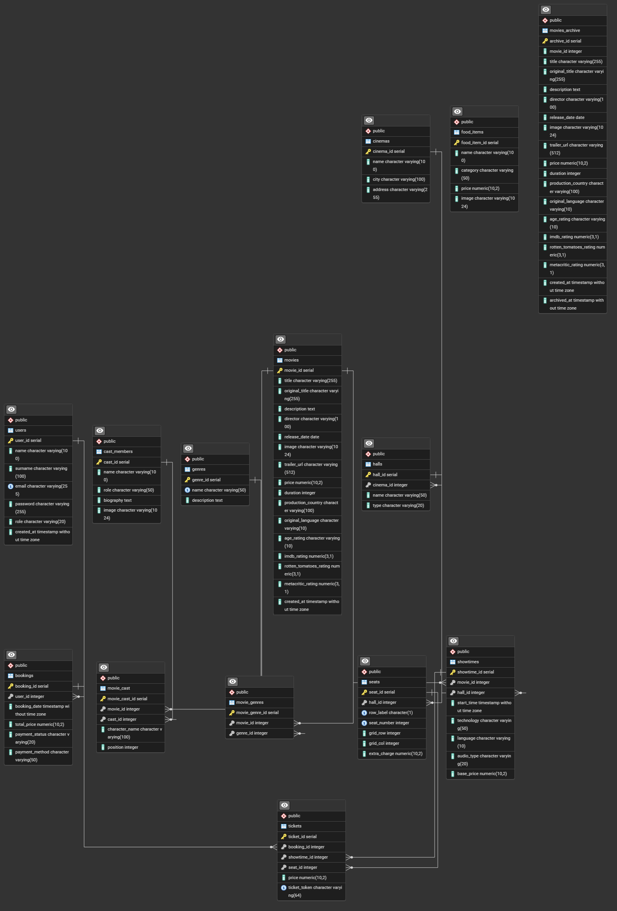

# 🎬 Absolute Cinema


> **Zaawansowana aplikacja webowa do zarządzania siecią kin oraz rezerwacji biletów online.**

---

## 📋 Spis Treści

- [O Projekcie](#-o-projekcie)
- [Kluczowe Funkcjonalności & Technologie](#-kluczowe-funkcjonalności--technologie)
- [Wzorce Projektowe](#-wzorce-projektowe)
- [Adnotacje PHP 8 (Attributes)](#-adnotacje-php-8-attributes)
- [Architektura i Baza Danych](#-architektura-i-baza-danych)
- [Instalacja i Uruchomienie](#-instalacja-i-uruchomienie)
- [Struktura Projektu](#-struktura-projektu)

---

## 🎯 O Projekcie

**Absolute Cinema** to kompleksowy system informatyczny zaprojektowany do obsługi sieci multipleksów kinowych. Aplikacja umożliwia zarówno klientom, jak i administratorom efektywne korzystanie z usług kinowych poprzez intuicyjny interfejs webowy.

### Główne możliwości systemu:

| Funkcja | Opis |
|---------|------|
| 🎬 **Repertuar** | Przeglądanie filmów aktualnie granych oraz nadchodzących premier |
| 📍 **Wybór lokalizacji** | Dynamiczny wybór kina z zachowaniem preferencji w sesji |
| 🪑 **Rezerwacja miejsc** | Interaktywna mapa sali kinowej z wizualizacją dostępności |
| 🍿 **Menu gastronomiczne** | Podgląd oferty przekąsek i napojów dostępnych w kinie |
| ⚙️ **Panel Administratora** | Pełne zarządzanie filmami, seansami oraz użytkownikami |

---

## 🚀 Kluczowe Funkcjonalności & Technologie

### A. Bezpieczeństwo i Walidacja (`validation.js`)

System implementuje wielowarstwowe mechanizmy bezpieczeństwa po stronie klienta:

#### 🔄 Mechanizm Debounce
- Optymalizacja walidacji poprzez **opóźnienie wykonania** funkcji sprawdzających
- Redukcja liczby zapytań do serwera przy wpisywaniu danych w czasie rzeczywistym
- Zastosowanie: weryfikacja dostępności emaila, walidacja formularzy

```javascript
// Przykład implementacji debounce
function debounce(func, delay = 300) {
    let timeoutId;
    return (...args) => {
        clearTimeout(timeoutId);
        timeoutId = setTimeout(() => func.apply(this, args), delay);
    };
}
```

#### 🛡️ Ochrona przed XSS i Injection
- **Sanityzacja danych wejściowych** - filtrowanie znaków specjalnych (`<`, `>`, `"`, `'`)
- **Walidacja regex** - weryfikacja formatów email, numerów telefonu, kodów pocztowych
- **Escape'owanie HTML** - bezpieczne renderowanie treści użytkownika w DOM

#### 🔐 Weryfikator Siły Hasła
- Analiza hasła w **czasie rzeczywistym** podczas rejestracji
- Wizualny wskaźnik siły (słabe → średnie → silne)
- Kryteria oceny:
  - Minimalna długość (8 znaków)
  - Obecność wielkich i małych liter
  - Cyfry i znaki specjalne

---

### B. Asynchroniczność i Fetch API

Aplikacja wykorzystuje nowoczesne **Fetch API** do dynamicznego ładowania treści, zapewniając płynne doświadczenie użytkownika bez przeładowywania strony (SPA-like).

#### 📡 Obszary ładowane asynchronicznie:

| Endpoint | Opis | Metoda |
|----------|------|--------|
| `/get-OnScreen-movies` | Filmy aktualnie wyświetlane | `GET` |
| `/get-Upcoming-movies` | Nadchodzące premiery | `GET` |
| `/get-snacks` | Oferta gastronomiczna | `GET` |
| `/get-showtimes` | Seanse dla wybranego filmu | `POST` |
| `/search` | Live Search filmów | `GET` |

#### Implementacja Tab Loadera:

```javascript
// Lazy loading zawartości zakładek
async function fetchData(apiUrl) {
    const response = await fetch(apiUrl);
    const data = await response.json();
    return data;
}
```

**Zalety podejścia asynchronicznego:**
- ⚡ Szybsze ładowanie początkowe strony
- 📉 Mniejsze zużycie transferu danych
- 🔄 Płynne przełączanie między zakładkami
- 💾 Cache'owanie wyników w pamięci przeglądarki

---

### C. System Rezerwacji i Sesje

#### 🪑 Interaktywna Mapa Sali (`seatLoader.js`)

System renderowania miejsc kinowych oparty jest na **dynamicznej siatce CSS Grid**:

- **Pobieranie układu sali** z bazy danych (współrzędne `grid_row`, `grid_col`)
- **Wizualizacja statusów miejsc:**
  - 🟢 Dostępne (klikalne)
  - 🔴 Zajęte (zablokowane)
  - 🟡 Wybrane przez użytkownika
  - ⭐ Miejsca VIP z dopłatą
- **Responsywność** - automatyczne skalowanie na urządzeniach mobilnych

#### 🔐 Zarządzanie Sesją PHP

System wykorzystuje mechanizm sesji do persystencji wyborów użytkownika:

```php
// Przechowywanie wybranego kina w sesji
$_SESSION['selected_cinema_id'] = $cinemaId;
$_SESSION['selected_cinema_name'] = $cinemaName;
```

**Przepływ wyboru kina:**

```
┌─────────────────┐      FETCH POST       ┌──────────────────┐
│   Frontend JS   │ ──────────────────►  │  /set-cinema     │
│  (Modal wyboru) │                       │  (Controller)    │
└─────────────────┘                       └────────┬─────────┘
                                                   │
                                                   ▼
                                          ┌──────────────────┐
                                          │   $_SESSION      │
                                          │  cinema_id: 1    │
                                          │  cinema_name:    │
                                          │  "Kraków Plaza"  │
                                          └──────────────────┘
```

**Funkcje sesji:**
- Timeout nieaktywności (600 sekund)
- Regeneracja ID sesji po zalogowaniu (ochrona przed Session Fixation)
- Przechowywanie roli użytkownika (`user`, `admin`, `employee`)

---

## � Wzorce Projektowe

Projekt wykorzystuje sprawdzone wzorce projektowe zapewniające czytelność, modularność i łatwość utrzymania kodu.

### 1. Front Controller

**Lokalizacja:** `index.php` + `Routing.php`

Wzorzec **Front Controller** centralizuje obsługę wszystkich żądań HTTP w jednym punkcie wejścia aplikacji.

```php
// index.php - Pojedynczy punkt wejścia
require 'Routing.php';

$path = trim($_SERVER['REQUEST_URI'], '/');
$path = parse_url($path, PHP_URL_PATH);

Routing::getInstance()->run($path);
```

**Zalety zastosowania:**
- ✅ Centralna obsługa routingu i middleware
- ✅ Jednolite zarządzanie sesją i autoryzacją
- ✅ Łatwe dodawanie nowych endpointów
- ✅ Spójne logowanie i obsługa błędów

**Przepływ żądania:**
```
┌──────────────┐     ┌──────────────┐     ┌──────────────────┐     ┌────────────┐
│   Klient     │ ──► │  index.php   │ ──► │   Routing.php    │ ──► │ Controller │
│  (Browser)   │     │ (Front Ctrl) │     │ (Route Matching) │     │  (Action)  │
└──────────────┘     └──────────────┘     └──────────────────┘     └────────────┘
```

---

### 2. Repository Pattern

**Lokalizacja:** `src/repository/*.php`

Wzorzec **Repository** oddziela logikę dostępu do danych od logiki biznesowej, tworząc warstwę abstrakcji nad bazą danych.

```php
// MovieRepository.php
class MovieRepository extends Repository {
    
    public function getMovieById(int $id): ?Movie {
        $stmt = $this->database->connect()->prepare(
            'SELECT * FROM movies WHERE movie_id = :id'
        );
        $stmt->bindParam(':id', $id, PDO::PARAM_INT);
        $stmt->execute();
        
        $stmt->setFetchMode(PDO::FETCH_CLASS, Movie::class);
        return $stmt->fetch() ?: null;
    }
    
    public function getMoviesOnScreen(): array {
        // Pobieranie filmów aktualnie granych
    }
}
```

**Repozytoria w projekcie:**

| Repozytorium | Odpowiedzialność |
|--------------|------------------|
| `UserRepository` | Użytkownicy, autentykacja, role |
| `MovieRepository` | Filmy, gatunki, obsada |
| `ShowtimeRepository` | Seanse, dostępność terminów |
| `BookingRepository` | Rezerwacje, bilety |
| `CinemaRepository` | Kina, sale, miejsca |
| `SnacksRepository` | Oferta gastronomiczna |

**Zalety zastosowania:**
- ✅ Separacja logiki SQL od kontrolerów
- ✅ Łatwe testowanie (możliwość mockowania)
- ✅ Wielokrotne użycie zapytań
- ✅ Centralne miejsce optymalizacji zapytań

---

### 3. Singleton

**Lokalizacja:** `Database.php`, `Routing.php`

Wzorzec **Singleton** gwarantuje istnienie tylko jednej instancji klasy w całej aplikacji.

```php
// Database.php - Singleton połączenia z bazą danych
class Database {
    private static ?Database $instance = null;
    private ?PDO $connection = null;

    private function __construct() {
        // Prywatny konstruktor
    }

    public static function getInstance(): Database {
        if (self::$instance === null) {
            self::$instance = new Database();
        }
        return self::$instance;
    }

    public function connect(): PDO {
        if ($this->connection === null) {
            $this->connection = new PDO(
                "pgsql:host={$host};port=5432;dbname={$db}",
                $user, $password
            );
        }
        return $this->connection;
    }
}
```

**Zastosowania Singleton w projekcie:**

| Klasa | Cel |
|-------|-----|
| `Database` | Jedno połączenie PDO dla całej aplikacji |
| `Routing` | Jedna instancja routera z mapą tras |

**Zalety zastosowania:**
- ✅ Oszczędność zasobów (jedno połączenie DB)
- ✅ Globalny punkt dostępu
- ✅ Lazy initialization (tworzenie przy pierwszym użyciu)
- ✅ Kontrola nad stanem współdzielonym

---

## 🏷️ Adnotacje PHP 8 (Attributes)

Projekt wykorzystuje natywne **Atrybuty PHP 8** jako mechanizm middleware do kontroli dostępu i walidacji żądań.

### Implementacja Atrybutów

#### `#[IsLoggedIn]` - Kontrola Autentykacji

**Lokalizacja:** `src/middleware/Attribute/IsLoggedIn.php`

```php
#[Attribute(Attribute::TARGET_METHOD)]
class IsLoggedIn {
    public function __construct(
        public bool $redirectOnFail = true
    ) {}
}
```

**Użycie w kontrolerze:**
```php
class MovieController extends AppController {
    
    #[IsLoggedIn]  // Wymaga zalogowania, przekieruje do /login
    public function getDetails(int $movieId) {
        // Tylko dla zalogowanych użytkowników
    }
    
    #[IsLoggedIn(redirectOnFail: false)]  // Zwróci 401 JSON
    public function getShowtimes() {
        // Endpoint API - bez przekierowania
    }
}
```

---

#### `#[AllowedMethods]` - Kontrola Metod HTTP

**Lokalizacja:** `src/middleware/Attribute/AllowedMethods.php`

```php
#[Attribute(Attribute::TARGET_METHOD)]
class AllowedMethods {
    public function __construct(
        public array $methods = ['GET']
    ) {}
}
```

**Użycie w kontrolerze:**
```php
class SecurityController extends AppController {
    
    #[AllowedMethods(['GET', 'POST'])]  // Akceptuje GET i POST
    public function login() {
        if ($this->isPost()) {
            // Logowanie użytkownika
        }
        $this->render('login');
    }
    
    #[AllowedMethods(['POST'])]  // Tylko POST
    public function register() {
        // Rejestracja
    }
}
```

---

### Middleware Handler

**Lokalizacja:** `src/middleware/MiddlewareHandler.php`

Klasa `MiddlewareHandler` przetwarza atrybuty za pomocą **Reflection API**:

```php
class MiddlewareHandler {
    public static function handle(object $controller, string $action): bool {
        $reflectionMethod = new ReflectionMethod($controller, $action);
        $attributes = $reflectionMethod->getAttributes();
        
        foreach ($attributes as $attribute) {
            $instance = $attribute->newInstance();
            
            if ($instance instanceof IsLoggedIn) {
                if (!isset($_SESSION['user_id'])) {
                    // Obsługa braku autoryzacji
                    return false;
                }
            }
            
            if ($instance instanceof AllowedMethods) {
                if (!in_array($_SERVER['REQUEST_METHOD'], $instance->methods)) {
                    http_response_code(405);
                    return false;
                }
            }
        }
        return true;
    }
}
```

**Zalety użycia Atrybutów:**
- ✅ Deklaratywna składnia (czytelność kodu)
- ✅ Logika autoryzacji oddzielona od biznesowej
- ✅ Łatwe rozszerzanie o nowe atrybuty
- ✅ Natywne wsparcie PHP 8 (bez zewnętrznych bibliotek)

---

## �🏗️ Architektura i Baza Danych

### Wzorzec MVC (Model-View-Controller)

Projekt implementuje czysty wzorzec **MVC** bez użycia ciężkich frameworków PHP:

```
src/
├── controllers/     # Logika biznesowa i routing
│   ├── AppController.php        # Klasa bazowa
│   ├── SecurityController.php   # Autentykacja
│   ├── MovieController.php      # Operacje na filmach
│   └── AdminController.php      # Panel administracyjny
│
├── models/          # Encje danych
│   ├── movie.php
│   ├── showtime.php
│   └── user.php
│
├── repository/      # Warstwa dostępu do danych (DAO)
│   ├── MovieRepository.php
│   ├── ShowtimeRepository.php
│   └── UserRepository.php
│
└── middleware/      # Atrybuty PHP 8 (autoryzacja)
    └── Attribute/
        ├── IsLoggedIn.php
        └── AllowedMethods.php
```

### Baza Danych PostgreSQL

System wykorzystuje relacyjną bazę danych **PostgreSQL 15+** z następującymi mechanizmami:

- **Triggery** - automatyczna archiwizacja usuniętych filmów
- **Widoki** - `all_movies_history` łączący aktywne filmy z archiwum
- **Kaskadowe usuwanie** - integralność referencyjna danych

### 📊 Diagram ERD

<p align="center">
  
</p>

> *Diagram przedstawia pełną strukturę relacyjnej bazy danych systemu Absolute Cinema.*

#### Główne encje i relacje:

| Tabela | Opis | Kluczowe relacje |
|--------|------|------------------|
| `users` | Użytkownicy systemu (klienci, admini) | → `bookings` (1:N) |
| `movies` | Katalog filmów z metadanymi | → `showtimes`, `movie_genres`, `movie_cast` |
| `movies_archive` | Archiwum usuniętych filmów (Trigger) | Kopia struktury `movies` |
| `cinemas` | Lokalizacje kin | → `halls` (1:N) |
| `halls` | Sale kinowe | → `seats`, `showtimes` |
| `seats` | Miejsca na sali (grid) | → `tickets` |
| `showtimes` | Seanse filmowe | → `tickets`, łączy `movies` + `halls` |
| `bookings` | Rezerwacje użytkowników | → `tickets` (1:N) |
| `tickets` | Bilety na konkretne miejsca | Łączy `bookings` + `showtimes` + `seats` |
| `genres` | Gatunki filmowe | → `movie_genres` (N:M) |
| `cast_members` | Aktorzy i twórcy | → `movie_cast` (N:M) |
| `food_items` | Menu gastronomiczne | Standalone |

---

## 🐳 Instalacja i Uruchomienie

### Wymagania

- **Docker** >= 20.0
- **Docker Compose** >= 2.0

### Szybki Start

1. **Sklonuj repozytorium:**
   ```bash
   git clone https://github.com/username/absolute-cinema.git
   cd absolute-cinema
   ```

2. **Uruchom kontenery Docker:**
   ```bash
   docker-compose up -d
   ```

3. **Otwórz aplikację:**
   - 🌐 Aplikacja: [http://localhost:8080](http://localhost:8080)
   - 🗄️ pgAdmin: [http://localhost:5050](http://localhost:5050)

### Struktura Docker

| Serwis | Port | Opis |
|--------|------|------|
| `web` | 8080 | Nginx (reverse proxy) |
| `php` | 9000 | PHP-FPM 8.0 |
| `db` | 5433 | PostgreSQL 15 |
| `pgadmin` | 5050 | Panel administracyjny bazy |

### Inicjalizacja Bazy Danych

Plik `docker/db/init.sql` automatycznie:
- ✅ Tworzy strukturę tabel (users, movies, showtimes, tickets, etc.)
- ✅ Konfiguruje **trigger archiwizacji** filmów
- ✅ Tworzy **widok** `all_movies_history`
- ✅ Wstawia przykładowe dane (admin, filmy, kina, seanse)

**Domyślne konto administratora:**
- 📧 Email: `admin@example.com`
- 🔑 Hasło: `admin123`

### Reset Bazy Danych

Aby zresetować bazę do stanu początkowego:
```bash
docker-compose down -v
docker-compose up -d
```

---

## 📁 Struktura Projektu

```
absolute-cinema/
├── 📂 docker/
│   ├── db/
│   │   └── init.sql          # Inicjalizacja bazy danych
│   ├── nginx/
│   │   └── nginx.conf        # Konfiguracja serwera
│   └── php/
│       └── Dockerfile        # Obraz PHP-FPM
│
├── 📂 public/
│   ├── images/               # Zasoby statyczne
│   ├── scripts/              # JavaScript (Frontend)
│   │   ├── validation.js     # Walidacja formularzy
│   │   ├── tabsLoader.js     # Ładowanie zakładek
│   │   ├── seatLoader.js     # Mapa miejsc
│   │   └── search.js         # Live Search
│   ├── styles/               # Arkusze CSS
│   └── views/                # Szablony HTML
│
├── 📂 src/
│   ├── controllers/          # Kontrolery MVC
│   ├── models/               # Modele danych
│   ├── repository/           # Repozytoria (DAO)
│   ├── middleware/           # Middleware (PHP 8 Attributes)
│   ├── DTOs/                 # Data Transfer Objects
│   └── valueObjects/         # Obiekty wartości (walidacja)
│
├── 📄 docker-compose.yaml    # Konfiguracja Docker
├── 📄 Routing.php            # Router aplikacji
├── 📄 Database.php           # Singleton połączenia DB
└── 📄 index.php              # Entry point
```

---

## 👥 Autorzy

- **Michał Langner**

---

## 📄 Licencja

Ten projekt został stworzony w celach edukacyjnych w ramach przedmiotu **WDPAI** (Wstęp do Programowania Aplikacji Internetowych).

---

<div align="center">

**⭐ Jeśli projekt Ci się podoba, zostaw gwiazdkę! ⭐**

</div>